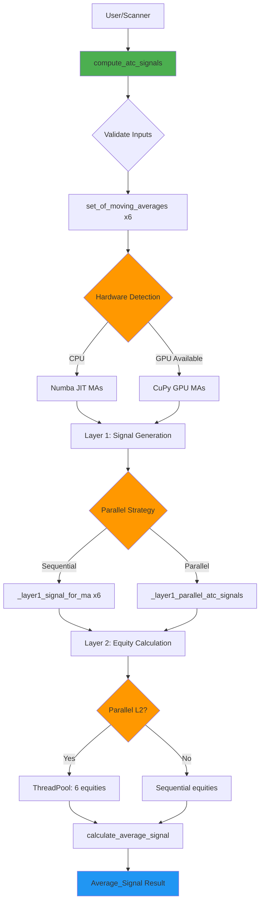
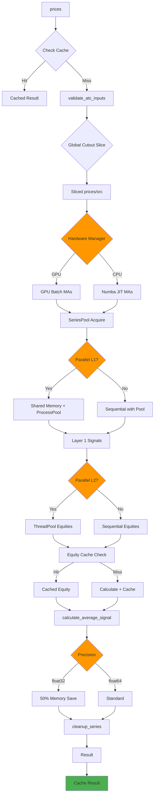
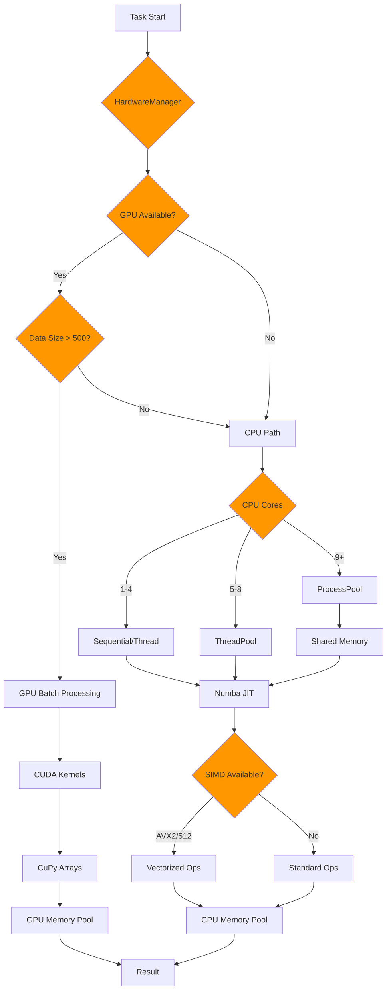
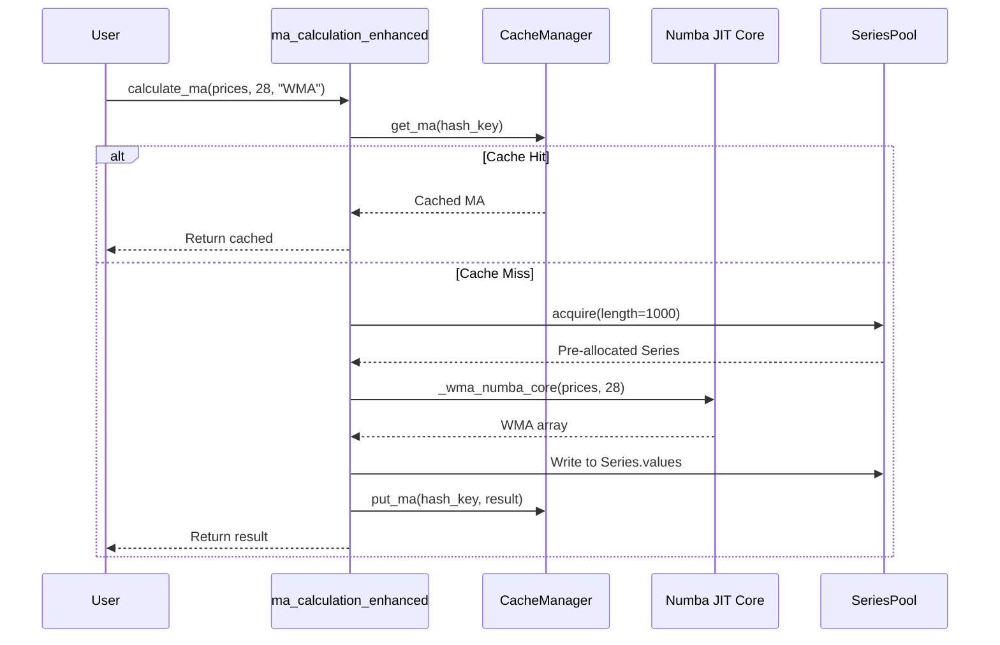
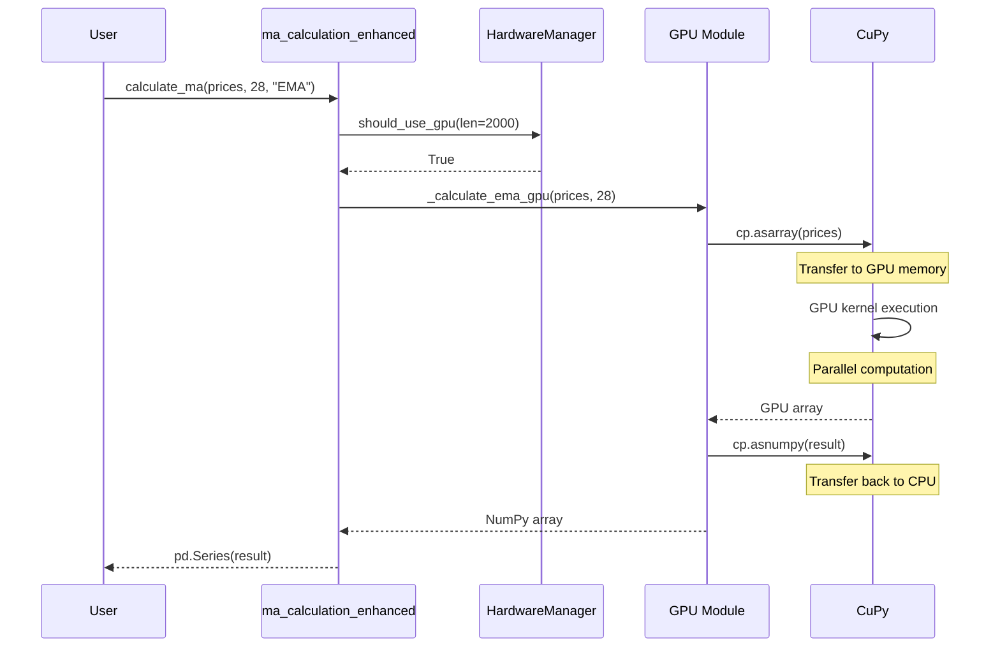
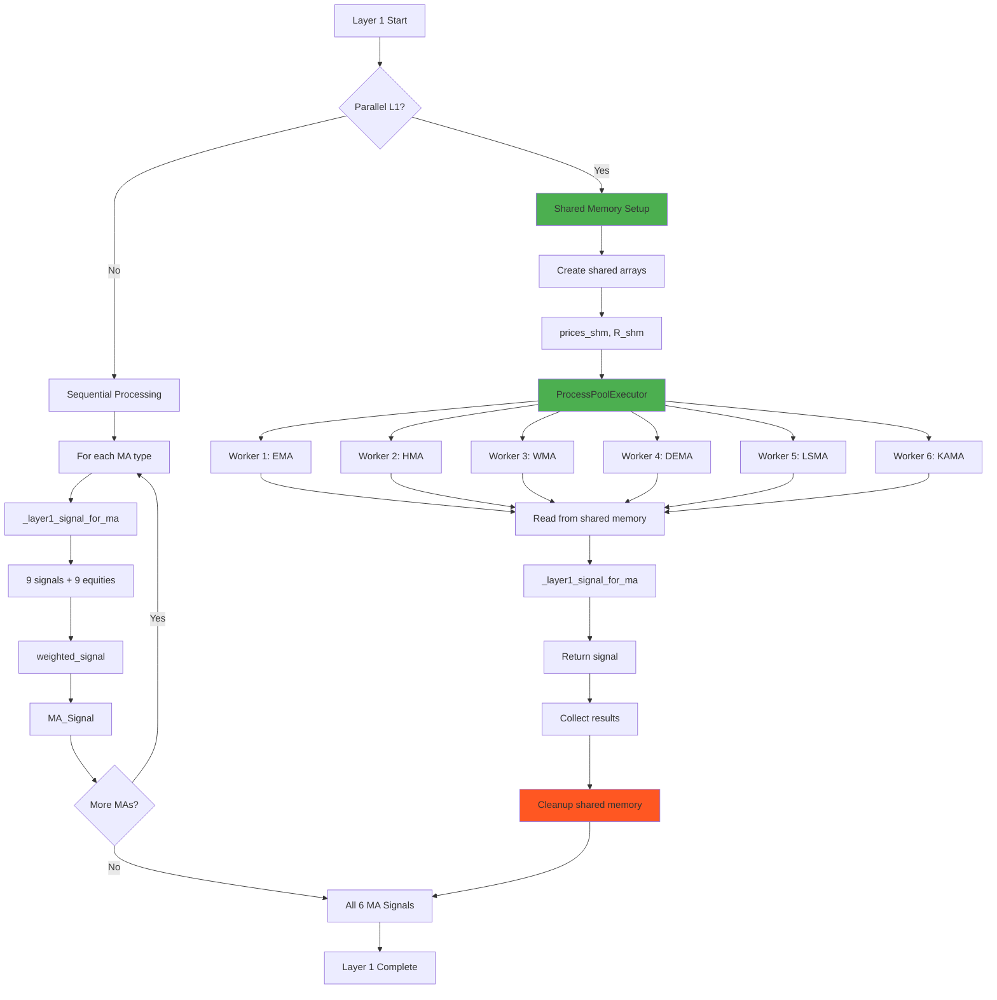
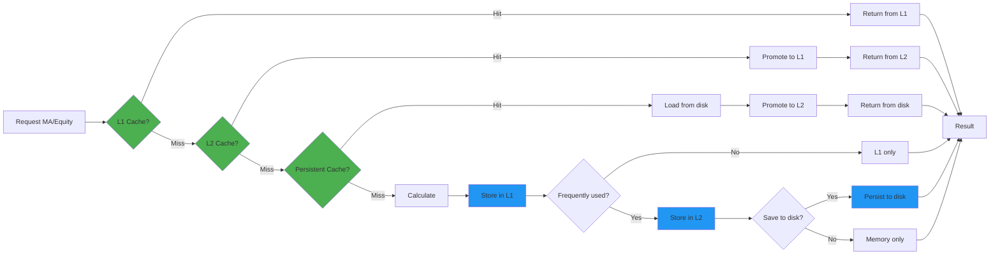
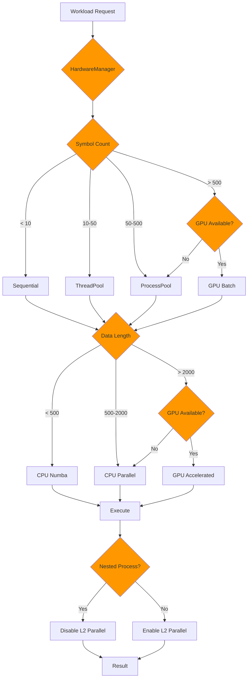
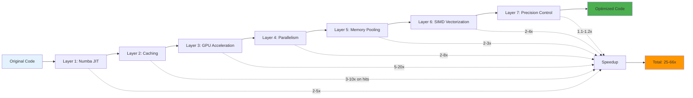

# Optimization Flow Diagram: adaptive_trend_enhance

## Overview

This document provides visual representations of how the `adaptive_trend_enhance` module optimizes the ATC calculation pipeline through hardware-aware routing, parallel processing, and memory management.

---

## 1. High-Level Module Call Hierarchy



---

## 2. Original vs Enhanced Flow Comparison

### Original (adaptive_trend)

```mermaid
graph LR
    A[prices] --> B[set_of_moving_averages]
    B --> C[9 MAs via pandas_ta]
    C --> D[_layer1_signal_for_ma]
    D --> E[equity_series x54]
    E --> F[calculate_layer2_equities]
    F --> G[equity_series x6]
    G --> H[Vectorized Average_Signal]
    H --> I[Result]

    style A fill:#E3F2FD
    style I fill:#E3F2FD
```



**Characteristics:**

- ❌ No caching
- ❌ No parallelism
- ❌ No GPU support
- ❌ No memory pooling
- ✅ Simple, straightforward

### Enhanced (adaptive_trend_enhance)



**Characteristics:**

- ✅ Multi-level caching
- ✅ Adaptive parallelism
- ✅ GPU acceleration
- ✅ Memory pooling
- ✅ Precision control
- ✅ Automatic cleanup

---

## 3. Hardware Resource Utilization Flow



---

## 4. Moving Average Calculation Flow

### CPU Path (Numba JIT)



### GPU Path (CuPy)



---

## 5. Layer 1 Parallel Processing Flow



---

## 6. Memory Management Flow

```mermaid
graph TD
    A[Function Start] --> B[@temp_series decorator]
    B --> C[MemoryManager.track_memory]

    C --> D[Allocate from SeriesPool]
    D --> E[Execute computation]

    E --> F{Memory > Threshold?}
    F -->|Yes| G[Trigger cleanup]
    F -->|No| H[Continue]

    G --> I[cleanup_series]
    I --> J[Release to SeriesPool]
    J --> K[gc.collect]

    H --> L[Function complete]
    K --> L

    L --> M[@temp_series cleanup]
    M --> N[Delete temp variables]
    N --> O[Force GC if large]

    O --> P[Return result]

    style B fill:#4CAF50
    style C fill:#2196F3
    style G fill:#FF9800
    style I fill:#FF5722
    style M fill:#FF5722
```

---

## 7. Cache Hierarchy Flow



**Cache Statistics:**

- L1: 128 entries, ~10ms access
- L2: 1024 entries, ~20ms access
- Disk: Unlimited, ~100ms access

---

## 8. Adaptive Workload Routing



---

## 9. Complete ATC Pipeline with Optimizations

```mermaid
graph TB
    Start[prices, config] --> V1[validate_atc_inputs]

    V1 --> Slice{cutout > 0?}
    Slice -->|Yes| S1[Global slice prices/src]
    Slice -->|No| S2[No slicing]

    S1 --> MA[set_of_moving_averages x6]
    S2 --> MA

    MA --> HW1{Hardware Check}
    HW1 -->|GPU| GPU1[CuPy GPU MAs]
    HW1 -->|CPU| CPU1[Numba JIT MAs]

    GPU1 --> Pool1[SeriesPool]
    CPU1 --> Pool1

    Pool1 --> ROC[rate_of_change]

    ROC --> L1{Parallel L1?}
    L1 -->|Yes| PL1[ProcessPool + Shared Memory]
    L1 -->|No| SL1[Sequential Layer 1]

    PL1 --> L1Sig[Layer 1 Signals x6]
    SL1 --> L1Sig

    L1Sig --> L2{Parallel L2?}
    L2 -->|Yes| PL2[ThreadPool Equities]
    L2 -->|No| SL2[Sequential Equities]

    PL2 --> EqCache{Equity Cache?}
    SL2 --> EqCache

    EqCache -->|Hit| CachedEq[Use cached]
    EqCache -->|Miss| CalcEq[Calculate + cache]

    CachedEq --> L2Eq[Layer 2 Equities x6]
    CalcEq --> L2Eq

    L2Eq --> Avg[calculate_average_signal]

    Avg --> Prec{Precision}
    Prec -->|float32| F32[50% memory]
    Prec -->|float64| F64[Standard]

    F32 --> Clean[cleanup_series]
    F64 --> Clean

    Clean --> Strat{strategy_mode?}
    Strat -->|Yes| Shift[shift(1)]
    Strat -->|No| NoShift[No shift]

    Shift --> Result[Average_Signal + all signals]
    NoShift --> Result

    Result --> Cache[Cache result]
    Cache --> End[Return dict]

    style HW1 fill:#FF9800
    style L1 fill:#FF9800
    style L2 fill:#FF9800
    style EqCache fill:#4CAF50
    style Pool1 fill:#2196F3
    style Clean fill:#FF5722
    style Cache fill:#4CAF50
```

---

## 10. Performance Optimization Layers



---

## Summary

The flow diagrams illustrate how `adaptive_trend_enhance` achieves massive performance gains through:

1. **Hardware-aware routing**: Automatically selects optimal execution path
2. **Multi-level parallelism**: Symbol-level + component-level
3. **Intelligent caching**: L1/L2/Persistent hierarchy
4. **Memory optimization**: Pooling + zero-copy + cleanup
5. **Adaptive strategies**: Cost-based decision making

All optimizations are **transparent** to the end user - the same API, same results, just 25-66x faster.
