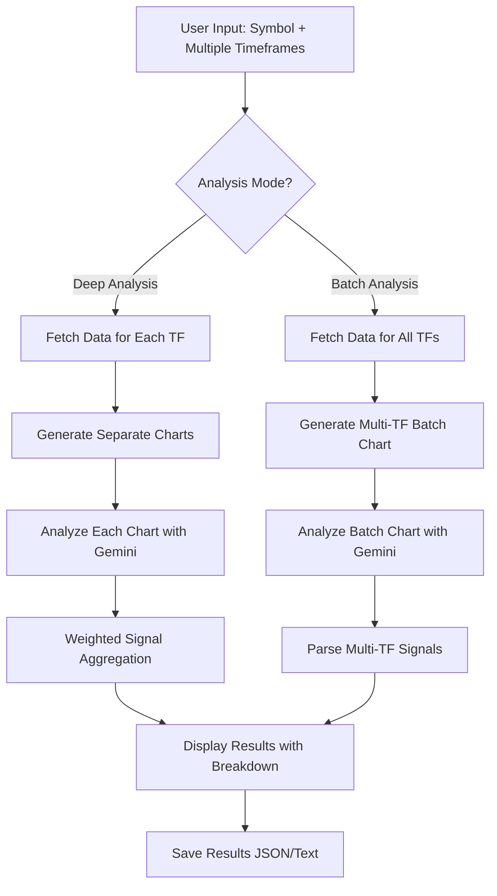

# Gemini Chart Analyzer

Module phân tích biểu đồ kỹ thuật bằng Google Gemini AI. Module này cho phép tạo biểu đồ từ dữ liệu OHLCV với các indicators (MA, RSI, MACD, Bollinger Bands) và gửi lên Google Gemini để nhận phân tích chi tiết với tín hiệu LONG/SHORT kèm Entry, Stop Loss và Take Profit.

## Workflow

### Single Timeframe Analysis (Mặc định)

1. **Nhập thông tin**: Nhập tên symbol (ví dụ: BTC/USDT) và timeframe (ví dụ: 1h, 4h, 1d)
2. **Cấu hình Indicators**: Chọn các indicators muốn hiển thị trên biểu đồ (MA, RSI, MACD, Bollinger Bands)
3. **Tạo biểu đồ**: Tự động fetch dữ liệu OHLCV và tạo biểu đồ với các indicators đã chọn
4. **Lưu ảnh**: Biểu đồ được lưu vào thư mục `modules/gemini_chart_analyzer/charts/`
5. **Phân tích bằng Gemini**: Gửi ảnh lên Google Gemini API để phân tích
6. **Nhận kết quả**: Nhận phân tích chi tiết với:
   - Xu hướng chính
   - Các mẫu hình nhận diện được
   - Phân tích indicators
   - Điểm vào lệnh/cắt lỗ tham khảo (LONG/SHORT với Entry, SL, TP)
   - Cảnh báo rủi ro
   - Khu vực thanh khoản (Liquidity zones)

### Multi-Timeframe Analysis (Mới)

Module hỗ trợ phân tích đa khung thời gian để tăng độ tin cậy của signals:

1. **Chọn Multiple Timeframes**: Chọn nhiều timeframes (ví dụ: `15m,1h,4h,1d`)
2. **Phân tích từng Timeframe**:
   - **Deep Analysis Mode**: Phân tích riêng từng timeframe, gửi riêng lẻ lên Gemini
   - **Batch Analysis Mode**: Gộp nhiều timeframes vào 1 batch chart
3. **Tổng hợp Signals**: Sử dụng weighted aggregation để tổng hợp signals từ các timeframes
4. **Nhận kết quả**:
   - Breakdown theo từng timeframe
   - Aggregated signal với confidence score
   - Phân tích chi tiết cho mỗi timeframe

## Cài đặt

### 1. Cài đặt dependencies

```bash
pip install matplotlib google-genai pillow
```

**Lưu ý:** Package mới là `google-genai` nhưng import trong code vẫn là:
```python
import google.generativeai as genai
```

Hoặc thêm vào `requirements.txt`:

```txt
matplotlib>=3.7.0
google-genai>=0.3.0
pillow>=10.0.0
```

### 2. Cấu hình Google Gemini API Key

1. Lấy API key từ một trong các link sau:
   - https://makersuite.google.com/app/apikey
   - https://aistudio.google.com/app/apikey

2. Thêm API key vào `config/config_api.py`:
```python
GEMINI_API_KEY = 'your-api-key-here'
```

Hoặc sử dụng biến môi trường:
```bash
export GEMINI_API_KEY='your-api-key-here'
```

## Sử dụng

### Chạy CLI

```bash
python -m modules.gemini_chart_analyzer.cli.chart_analyzer_main
```

Hoặc tạo file main riêng:

```python
from modules.gemini_chart_analyzer.cli.chart_analyzer_main import main

if __name__ == "__main__":
    main()
```

### Workflow tương tác

1. **Nhập Symbol**: Nhập symbol muốn phân tích (ví dụ: `BTC/USDT`)
2. **Chọn Analysis Mode**:
   - **Single Timeframe**: Phân tích 1 timeframe (ví dụ: `1h`, `4h`, `1d`)
   - **Multi-Timeframe**: Phân tích nhiều timeframes (ví dụ: `15m,1h,4h,1d`) - **Khuyến nghị**
3. **Cấu hình Indicators**:
   - Moving Averages: Chọn các periods (ví dụ: `20,50,200`)
   - RSI: Chọn period (mặc định: `14`)
   - MACD: Bật/tắt
   - Bollinger Bands: Bật/tắt và chọn period
4. **Chọn loại Prompt**:
   - **Detailed**: Phân tích chi tiết với cấu trúc đầy đủ (khuyến nghị)
   - **Simple**: Phân tích đơn giản
   - **Custom**: Nhập prompt tùy chỉnh

### Sử dụng trong code

```python
from modules.common.core.exchange_manager import ExchangeManager
from modules.common.core.data_fetcher import DataFetcher
from modules.gemini_chart_analyzer.core.generators.chart_generator import ChartGenerator
from modules.gemini_chart_analyzer.core.analyzers.gemini_chart_analyzer import GeminiChartAnalyzer

# 1. Fetch dữ liệu
exchange_manager = ExchangeManager()
data_fetcher = DataFetcher(exchange_manager)
df, exchange_id = data_fetcher.fetch_ohlcv_with_fallback_exchange(
    symbol="BTC/USDT",
    timeframe="1h",
    limit=500
)

# 2. Tạo biểu đồ
chart_generator = ChartGenerator()
indicators = {
    'MA': {'periods': [20, 50, 200]},
    'RSI': {'period': 14},
    'MACD': {'fast': 12, 'slow': 26, 'signal': 9}
}
chart_path = chart_generator.create_chart(
    df=df,
    symbol="BTC/USDT",
    timeframe="1h",
    indicators=indicators
)

# 3. Phân tích bằng Gemini
gemini_analyzer = GeminiChartAnalyzer()
result = gemini_analyzer.analyze_chart(
    image_path=chart_path,
    symbol="BTC/USDT",
    timeframe="1h",
    prompt_type="detailed"
)

print(result)
```

## Multi-Timeframe Analysis

Multi-Timeframe Analysis là tính năng mạnh mẽ cho phép phân tích cùng một symbol trên nhiều khung thời gian khác nhau, sau đó tổng hợp signals để tăng độ tin cậy. Tính năng này giúp:

- **Tăng độ tin cậy**: Signals được xác nhận trên nhiều timeframes có độ tin cậy cao hơn
- **Giảm false signals**: Lọc bỏ các tín hiệu chỉ xuất hiện trên 1 timeframe
- **Phân tích toàn diện**: Hiểu rõ xu hướng từ ngắn hạn đến dài hạn

### Workflow Multi-Timeframe Analysis



### Deep Analysis Mode

Phân tích riêng từng timeframe, gửi riêng lẻ lên Gemini, sau đó tổng hợp kết quả:

**Workflow:**

```text
┌─────────────────────────────────────────────────────────────────┐
│              MULTI-TIMEFRAME DEEP ANALYSIS WORKFLOW             │
└─────────────────────────────────────────────────────────────────┘

1. KHỞI TẠO
   │
   ├─> User chọn symbol và multiple timeframes (ví dụ: 15m,1h,4h,1d)
   │
   └─> MultiTimeframeCoordinator được khởi tạo

2. PHÂN TÍCH TỪNG TIMEFRAME (Loop)
   │
   ├─> TIMEFRAME 1: 15m
   │   │
   │   ├─> Fetch OHLCV data cho 15m
   │   ├─> Generate chart với indicators
   │   ├─> Gửi lên Gemini để phân tích
   │   └─> Lưu kết quả: {signal, confidence, analysis}
   │
   ├─> TIMEFRAME 2: 1h
   │   │
   │   ├─> Fetch OHLCV data cho 1h
   │   ├─> Generate chart với indicators
   │   ├─> Gửi lên Gemini để phân tích
   │   └─> Lưu kết quả: {signal, confidence, analysis}
   │
   ├─> TIMEFRAME 3: 4h
   │   └─> (tương tự...)
   │
   └─> TIMEFRAME 4: 1d
       └─> (tương tự...)

3. TỔNG HỢP SIGNALS
   │
   ├─> SignalAggregator.aggregate_signals()
   │   │
   │   ├─> Tính weighted confidence cho mỗi signal type:
   │   │   ├─> LONG weighted confidence
   │   │   ├─> SHORT weighted confidence
   │   │   └─> NONE weighted confidence
   │   │
   │   ├─> Weights theo timeframe:
   │   │   ├─> 15m: 0.1
   │   │   ├─> 1h: 0.2
   │   │   ├─> 4h: 0.25
   │   │   └─> 1d: 0.3
   │   │
   │   └─> Xác định final signal dựa trên weighted confidences
   │
   └─> Kết quả: {
         'signal': 'LONG' | 'SHORT' | 'NONE',
         'confidence': float (0.0-1.0),
         'timeframe_breakdown': {...},
         'weights_used': {...}
       }

4. HIỂN THỊ KẾT QUẢ
   │
   ├─> Console output:
   │   ├─> Breakdown theo timeframe:
   │   │   └─> 15m: LONG (confidence: 0.70) ████████
   │   │   └─> 1h:  LONG (confidence: 0.80) ██████████
   │   │   └─> 4h:  SHORT (confidence: 0.60) ██████
   │   │   └─> 1d:  LONG (confidence: 0.75) ████████
   │   │
   │   └─> AGGREGATED: LONG (confidence: 0.71) ████████
   │
   └─> File output:
       ├─> JSON: {symbol}_multi_tf_{timestamp}.json
       └─> Text: {symbol}_multi_tf_{timestamp}.txt
```

### Batch Analysis Mode

Gộp nhiều timeframes vào 1 batch chart (mỗi symbol có sub-charts cho các timeframes):

**Workflow:**

```text
┌─────────────────────────────────────────────────────────────────┐
│           MULTI-TIMEFRAME BATCH ANALYSIS WORKFLOW                │
└─────────────────────────────────────────────────────────────────┘

1. KHỞI TẠO
   │
   ├─> User chọn multiple timeframes (ví dụ: 15m,1h,4h,1d)
   │
   └─> MarketBatchScanner với ChartMultiTimeframeBatchGenerator

2. LẤY DANH SÁCH SYMBOLS
   │
   └─> Trả về: List[str] symbols (ví dụ: ['BTC/USDT', 'ETH/USDT', ...])

3. CHIA THÀNH BATCHES
   │
   ├─> Chia symbols thành các batch
   │   └─> Mỗi batch chứa tối đa 25 symbols (giảm vì mỗi symbol có nhiều TFs)
   │
   └─> Ví dụ: 100 symbols → 4 batches (25, 25, 25, 25)

4. XỬ LÝ TỪNG BATCH (Loop)
   │
   ├─> BATCH 1/N
   │   │
   │   ├─> 4.1. FETCH OHLCV DATA CHO TẤT CẢ TIMEFRAMES
   │   │   │
   │   │   ├─> Với mỗi symbol trong batch:
   │   │   │   ├─> Fetch data cho 15m
   │   │   │   ├─> Fetch data cho 1h
   │   │   │   ├─> Fetch data cho 4h
   │   │   │   └─> Fetch data cho 1d
   │   │   │
   │   │   └─> Lưu vào: {symbol: {timeframe: df}}
   │   │
   │   ├─> 4.2. TẠO MULTI-TF BATCH CHART IMAGE
   │   │   │
   │   │   ├─> ChartMultiTimeframeBatchGenerator.create_multi_tf_batch_chart()
   │   │   │   │
   │   │   │   ├─> Layout: Mỗi symbol có sub-charts cho các timeframes
   │   │   │   │   │
   │   │   │   │   Symbol 1: [15m] [1h]
   │   │   │   │             [4h]  [1d]
   │   │   │   │
   │   │   │   │   Symbol 2: [15m] [1h]
   │   │   │   │             [4h]  [1d]
   │   │   │   │             ...
   │   │   │   │
   │   │   │   └─> Lưu ảnh: charts/batch/batch_chart_multi_tf_{tfs}_{timestamp}_batch{N}.png
   │   │   │
   │   │   └─> Kết quả: Đường dẫn đến multi-TF batch chart image
   │   │
   │   ├─> 4.3. PHÂN TÍCH BẰNG GEMINI
   │   │   │
   │   │   ├─> GeminiBatchChartAnalyzer với multi-TF prompt
   │   │   │   │
   │   │   │   ├─> Prompt yêu cầu:
   │   │   │   │   ├─> Phân tích tất cả symbols × timeframes
   │   │   │   │   ├─> Trả về JSON với structure:
   │   │   │   │   │   {
   │   │   │   │   │     "BTC/USDT": {
   │   │   │   │   │       "15m": {"signal": "LONG", "confidence": 0.7},
   │   │   │   │   │       "1h": {"signal": "LONG", "confidence": 0.8},
   │   │   │   │   │       "4h": {"signal": "SHORT", "confidence": 0.6},
   │   │   │   │   │       "1d": {"signal": "LONG", "confidence": 0.75},
   │   │   │   │   │       "aggregated": {"signal": "LONG", "confidence": 0.71}
   │   │   │   │   │     },
   │   │   │   │   │     ...
   │   │   │   │   │   }
   │   │   │   │   │
   │   │   │   ├─> Parse JSON response
   │   │   │   │
   │   │   │   └─> Aggregate signals cho mỗi symbol
   │   │   │
   │   │   └─> Kết quả: Dict[symbol, {timeframes: {...}, aggregated: {...}}]
   │   │
   │   └─> Lặp lại cho batch tiếp theo...
   │
   └─> Sau khi xử lý tất cả batches

5. TỔNG HỢP KẾT QUẢ
   │
   ├─> Extract aggregated signals từ mỗi symbol
   ├─> Phân loại và sắp xếp theo confidence
   └─> Lưu kết quả vào JSON với multi-TF structure
```

### Sử dụng Multi-Timeframe Analysis

#### Chạy CLI với Multi-Timeframe

**Deep Analysis Mode:**

```bash
# Sử dụng --timeframes argument
python -m modules.gemini_chart_analyzer.cli.chart_analyzer_main --symbol BTC/USDT --timeframes 15m,1h,4h,1d

# Hoặc sử dụng interactive menu và chọn "Multi-timeframe" mode
python -m modules.gemini_chart_analyzer.cli.chart_analyzer_main
```

**Batch Analysis Mode:**

```bash
# Chạy batch scanner và chọn "Multi-timeframe" mode
python -m modules.gemini_chart_analyzer.cli.batch_scanner_main
```

#### Sử dụng trong code

**Deep Analysis Mode:**

```python
from modules.gemini_chart_analyzer.core.analyzers.multi_timeframe_coordinator import MultiTimeframeCoordinator
from modules.common.core.exchange_manager import ExchangeManager
from modules.common.core.data_fetcher import DataFetcher
from modules.gemini_chart_analyzer.core.generators.chart_generator import ChartGenerator
from modules.gemini_chart_analyzer.core.analyzers.gemini_chart_analyzer import GeminiChartAnalyzer

# Khởi tạo components
exchange_manager = ExchangeManager()
data_fetcher = DataFetcher(exchange_manager)
chart_generator = ChartGenerator()
gemini_analyzer = GeminiChartAnalyzer()

# Khởi tạo multi-timeframe analyzer
mtf_analyzer = MultiTimeframeCoordinator()

# Define helper functions
def fetch_data(symbol, timeframe):
    df, _ = data_fetcher.fetch_ohlcv_with_fallback_exchange(
        symbol=symbol, timeframe=timeframe, limit=500
    )
    return df

def generate_chart(df, symbol, timeframe):
    return chart_generator.create_chart(
        df=df, symbol=symbol, timeframe=timeframe,
        indicators={'MA': {'periods': [20, 50, 200]}, 'RSI': {'period': 14}}
    )

def analyze_chart(chart_path, symbol, timeframe):
    return gemini_analyzer.analyze_chart(
        image_path=chart_path, symbol=symbol, timeframe=timeframe
    )

# Chạy multi-timeframe analysis
results = mtf_analyzer.analyze_deep(
    symbol="BTC/USDT",
    timeframes=['15m', '1h', '4h', '1d'],
    fetch_data_func=fetch_data,
    generate_chart_func=generate_chart,
    analyze_chart_func=analyze_chart
)

# Kết quả
print(f"Aggregated Signal: {results['aggregated']['signal']}")
print(f"Confidence: {results['aggregated']['confidence']:.2f}")

# Breakdown theo timeframe
for tf, tf_result in results['timeframes'].items():
    print(f"{tf}: {tf_result['signal']} (confidence: {tf_result['confidence']:.2f})")
```

**Batch Analysis Mode:**

```python
from modules.gemini_chart_analyzer.core.scanners.market_batch_scanner import MarketBatchScanner

# Khởi tạo scanner
scanner = MarketBatchScanner(
    charts_per_batch=25,  # Giảm vì mỗi symbol có nhiều TFs
    cooldown_seconds=2.5
)

# Chạy scan với multi-timeframe
results = scanner.scan_market(
    timeframes=['15m', '1h', '4h', '1d'],  # Multi-timeframe mode
    max_symbols=None,
    limit=200
)

# Kết quả đã được aggregated
print(f"LONG signals: {len(results['long_symbols'])}")
for symbol, confidence in results['long_symbols_with_confidence']:
    print(f"{symbol}: {confidence:.2f}")
```

### Timeframe Weights

Hệ thống sử dụng weighted aggregation, với weights mặc định:

| Timeframe | Weight | Lý do |
|-----------|--------|-------|
| 15m       | 0.1    | Ngắn hạn, dễ bị nhiễu |
| 30m       | 0.15   | Ngắn hạn |
| 1h        | 0.2    | Trung hạn |
| 4h        | 0.25   | Trung-dài hạn |
| 1d        | 0.3    | Dài hạn, quan trọng hơn |
| 1w        | 0.35   | Rất dài hạn, quan trọng nhất |

**Công thức tính weighted confidence:**

```text
weighted_confidence = Σ(confidence_i × weight_i) / Σ(weight_i)
```

### Output của Multi-Timeframe Analysis

#### Console Output (Deep Analysis)

```
============================================================
MULTI-TIMEFRAME ANALYSIS RESULTS
============================================================

Symbol: BTC/USDT

15m: LONG (confidence: 0.70) ████████
1h:  LONG (confidence: 0.80) ██████████
4h:  SHORT (confidence: 0.60) ██████
1d:  LONG (confidence: 0.75) ████████

AGGREGATED: LONG (confidence: 0.71) ████████
============================================================
```

#### JSON File (Deep Analysis)

```json
{
  "symbol": "BTC/USDT",
  "timestamp": "2024-01-01T12:00:00",
  "timeframes_list": ["15m", "1h", "4h", "1d"],
  "timeframes": {
    "15m": {
      "signal": "LONG",
      "confidence": 0.70,
      "analysis": "..."
    },
    "1h": {
      "signal": "LONG",
      "confidence": 0.80,
      "analysis": "..."
    },
    "4h": {
      "signal": "SHORT",
      "confidence": 0.60,
      "analysis": "..."
    },
    "1d": {
      "signal": "LONG",
      "confidence": 0.75,
      "analysis": "..."
    }
  },
  "aggregated": {
    "signal": "LONG",
    "confidence": 0.71,
    "weights_used": {
      "15m": 0.1,
      "1h": 0.2,
      "4h": 0.25,
      "1d": 0.3
    }
  }
}
```

#### JSON File (Batch Analysis)

```json
{
  "timestamp": "2024-01-01T12:00:00",
  "timeframe": "1h",
  "timeframes": ["15m", "1h", "4h", "1d"],
  "summary": {
    "total_symbols": 100,
    "scanned_symbols": 98,
    "long_count": 12,
    "short_count": 8,
    "avg_long_confidence": 0.73,
    "avg_short_confidence": 0.68
  },
  "long_symbols": ["BTC/USDT", "ETH/USDT", ...],
  "all_results": {
    "BTC/USDT": {
      "signal": "LONG",
      "confidence": 0.71
    },
    ...
  }
}
```

### Lợi ích của Multi-Timeframe Analysis

1. **Tăng độ tin cậy**: Signals được xác nhận trên nhiều timeframes có độ tin cậy cao hơn
2. **Giảm false signals**: Lọc bỏ các tín hiệu chỉ xuất hiện trên 1 timeframe
3. **Phân tích toàn diện**: Hiểu rõ xu hướng từ ngắn hạn đến dài hạn
4. **Weighted aggregation**: Timeframe lớn hơn có trọng số cao hơn (phù hợp với phân tích kỹ thuật)
5. **Flexible**: Hỗ trợ cả Deep Analysis (riêng lẻ) và Batch Analysis (gộp)

### Lưu ý khi sử dụng Multi-Timeframe Analysis

1. **API Calls**:
   - **Deep Analysis**: N timeframes = N API calls (có thể nhiều hơn)
   - **Batch Analysis**: 1 API call cho tất cả symbols + timeframes (hiệu quả hơn)

2. **Timeframe Selection**:
   - Khuyến nghị: `15m, 1h, 4h, 1d` cho phân tích toàn diện
   - Có thể tùy chỉnh theo nhu cầu

3. **Weights**:
   - Có thể tùy chỉnh weights trong `config/gemini_chart_analyzer.py`
   - Timeframe lớn hơn thường có weight cao hơn

4. **Confidence Threshold**:
   - Aggregated confidence > 0.7: Signal mạnh
   - Aggregated confidence 0.5-0.7: Signal trung bình
   - Aggregated confidence < 0.5: Signal yếu hoặc NONE

## Batch Analyzer

Batch Analyzer là tính năng mạnh mẽ cho phép quét toàn bộ thị trường cùng lúc bằng cách nhóm nhiều biểu đồ vào một ảnh duy nhất và gửi lên Gemini để phân tích. Tính năng này giúp tiết kiệm thời gian và API calls khi cần phân tích hàng trăm hoặc hàng nghìn symbols.

### Workflow của Batch Analyzer

```
┌─────────────────────────────────────────────────────────────────┐
│                    BATCH ANALYZER WORKFLOW                      │
└─────────────────────────────────────────────────────────────────┘

1. KHỞI TẠO
   │
   ├─> MarketBatchScanner được khởi tạo
   │   ├─> charts_per_batch: 100 (mặc định)
   │   ├─> cooldown_seconds: 2.5s (giữa các batch requests)
   │   ├─> quote_currency: 'USDT'
   │   └─> exchange_name: 'binance' (mặc định)
   │
   └─> Khởi tạo các components:
       ├─> ExchangeManager: Quản lý kết nối exchange
       ├─> DataFetcher: Fetch dữ liệu OHLCV
       ├─> ChartBatchGenerator: Tạo batch chart images
       └─> GeminiBatchChartAnalyzer: Phân tích batch charts

2. LẤY DANH SÁCH SYMBOLS
   │
   ├─> Kết nối đến exchange (mặc định: Binance, có thể tùy chỉnh)
   ├─> Load markets và filter:
   │   ├─> Quote currency = USDT
   │   ├─> Active markets only
   │   └─> Spot markets only
   │
   └─> Trả về: List[str] symbols (ví dụ: ['BTC/USDT', 'ETH/USDT', ...])

3. CHIA THÀNH BATCHES
   │
   ├─> Chia symbols thành các batch
   │   └─> Mỗi batch chứa tối đa 100 symbols (10x10 grid)
   │
   └─> Ví dụ: 350 symbols → 4 batches (100, 100, 100, 50)

4. XỬ LÝ TỪNG BATCH (Loop)
   │
   ├─> BATCH 1/N
   │   │
   │   ├─> 4.1. FETCH OHLCV DATA
   │   │   │
   │   │   ├─> Với mỗi symbol trong batch:
   │   │   │   ├─> Fetch OHLCV data từ exchange
   │   │   │   ├─> Validate: >= min_candles (default: 20, configurable)
   │   │   │   └─> Lưu vào symbols_data: [{'symbol': 'BTC/USDT', 'df': DataFrame}, ...]
   │   │   │
   │   │   └─> Kết quả: List[Dict] với 'symbol' và 'df' keys
   │   │
   │   ├─> 4.2. TẠO BATCH CHART IMAGE
   │   │   │
   │   │   ├─> ChartBatchGenerator.create_batch_chart()
   │   │   │   │
   │   │   │   ├─> Tạo figure lớn: 10 rows × 10 cols = 100 subplots
   │   │   │   │
   │   │   │   ├─> Với mỗi symbol:
   │   │   │   │   ├─> Tính toán vị trí grid (row, col)
   │   │   │   │   ├─> Tạo subplot tại vị trí đó
   │   │   │   │   ├─> Vẽ candlestick chart đơn giản:
   │   │   │   │   │   ├─> Màu xanh: Nến tăng (close >= open)
   │   │   │   │   │   ├─> Màu đỏ: Nến giảm (close < open)
   │   │   │   │   │   └─> Thêm label symbol ở góc trên trái
   │   │   │   │   └─> Style: Dark background, white text
   │   │   │   │
   │   │   │   └─> Lưu ảnh: charts/batch/batch_chart_{timeframe}_{timestamp}_batch{N}.png
   │   │   │
   │   │   └─> Kết quả: Đường dẫn đến batch chart image
   │   │
   │   ├─> 4.3. PHÂN TÍCH BẰNG GEMINI
   │   │   │
   │   │   ├─> GeminiBatchChartAnalyzer.analyze_batch_chart()
   │   │   │   │
   │   │   │   ├─> Apply cooldown (2.5s) để tránh rate limit
   │   │   │   │
   │   │   │   ├─> Tạo batch prompt:
   │   │   │   │   ├─> Liệt kê tất cả symbols trong batch
   │   │   │   │   ├─> Yêu cầu phân tích từng biểu đồ
   │   │   │   │   ├─> Yêu cầu trả về JSON format:
   │   │   │   │   │   {
   │   │   │   │   │     "BTC/USDT": {"signal": "LONG", "confidence": 0.85},
   │   │   │   │   │     "ETH/USDT": {"signal": "SHORT", "confidence": 0.70},
   │   │   │   │   │     ...
   │   │   │   │   │   }
   │   │   │   │   └─> Signal: LONG | SHORT | NONE
   │   │   │   │       Confidence: 0.0 - 1.0
   │   │   │   │
   │   │   │   ├─> Gửi ảnh + prompt lên Gemini API
   │   │   │   │   ├─> Retry logic: 3 lần nếu gặp lỗi 503/429
   │   │   │   │   └─> Exponential backoff
   │   │   │   │
   │   │   │   ├─> Parse JSON response:
   │   │   │   │   ├─> Extract JSON từ markdown code blocks (nếu có)
   │   │   │   │   ├─> Validate tất cả symbols có trong response
   │   │   │   │   ├─> Normalize format: {"signal": str, "confidence": float}
   │   │   │   │   └─> Clamp confidence: [0.0, 1.0]
   │   │   │   │
   │   │   │   └─> Kết quả: Dict[symbol, {"signal": str, "confidence": float}]
   │   │   │
   │   │   └─> Merge vào all_results
   │   │
   │   └─> Lặp lại cho batch tiếp theo...
   │
   └─> Sau khi xử lý tất cả batches

5. TỔNG HỢP KẾT QUẢ
   │
   ├─> Phân loại signals:
   │   ├─> long_symbols_with_confidence: [(symbol, confidence), ...]
   │   ├─> short_symbols_with_confidence: [(symbol, confidence), ...]
   │   └─> none_symbols_with_confidence: [(symbol, confidence), ...]
   │
   ├─> Sắp xếp theo confidence (descending):
   │   ├─> LONG: Từ confidence cao → thấp
   │   ├─> SHORT: Từ confidence cao → thấp
   │   └─> NONE: Từ confidence cao → thấp
   │
   ├─> Tính toán summary statistics:
   │   ├─> total_symbols, scanned_symbols
   │   ├─> long_count, short_count, none_count
   │   ├─> long_percentage, short_percentage
   │   └─> avg_long_confidence, avg_short_confidence
   │
   └─> Lưu kết quả vào file JSON:
       └─> analysis_results/batch_scan/batch_scan_{timeframe}_{timestamp}.json
           {
             "timestamp": "2024-01-01T12:00:00",
             "timeframe": "1h",
             "summary": {...},
             "long_symbols": ["BTC/USDT", "ETH/USDT", ...],  // Sorted by confidence
             "short_symbols": [...],
             "long_symbols_with_confidence": [["BTC/USDT", 0.85], ...],
             "short_symbols_with_confidence": [...],
             "all_results": {
               "BTC/USDT": {"signal": "LONG", "confidence": 0.85},
               ...
             }
           }

6. HIỂN THỊ KẾT QUẢ
   │
   ├─> Console output:
   │   ├─> LONG Signals (sorted by confidence)
   │   │   └─> Symbol | Confidence: X.XX ████████
   │   ├─> SHORT Signals (sorted by confidence)
   │   │   └─> Symbol | Confidence: X.XX ████████
   │   └─> Summary statistics
   │
   └─> File path được hiển thị
```

### Các thành phần chính

#### 1. MarketBatchScanner
Class chính điều phối toàn bộ quy trình batch scanning:
- Quản lý vòng đời của batch processing
- Kết nối với exchange để lấy danh sách symbols
- Chia symbols thành batches
- Điều phối fetch data, generate charts, và analyze

#### 2. ChartBatchGenerator
Tạo batch chart images chứa nhiều biểu đồ:
- Nhóm 100 biểu đồ vào một ảnh (10x10 grid)
- Mỗi biểu đồ là candlestick chart đơn giản với label symbol
- Tối ưu hóa kích thước và DPI cho Gemini API

#### 3. ChartMultiTimeframeBatchGenerator
Tạo batch chart images với multi-timeframe per symbol:
- Nhóm 25 symbols vào một ảnh (mỗi symbol có 4 timeframes)
- Layout: Mỗi symbol có sub-charts cho các timeframes (2x2 grid)
- Tối ưu hóa cho multi-TF analysis

#### 4. GeminiBatchChartAnalyzer
Phân tích batch charts bằng Gemini API:
- Gửi batch chart image lên Gemini
- Yêu cầu JSON response với signal và confidence
- Hỗ trợ cả single-TF và multi-TF prompts
- Parse và validate JSON response
- Xử lý rate limiting và retry logic

#### 5. SignalAggregator
Tổng hợp signals từ nhiều timeframes:
- Weighted aggregation với weights theo timeframe
- Tính weighted confidence cho mỗi signal type
- Xác định final signal dựa trên weighted confidences

#### 6. MultiTimeframeCoordinator
Điều phối multi-timeframe analysis:
- Deep Analysis Mode: Phân tích riêng từng timeframe
- Batch Analysis Mode: Gộp nhiều timeframes vào batch chart
- Tích hợp với SignalAggregator để tổng hợp kết quả

### Sử dụng Batch Analyzer

#### Chạy CLI

```bash
python main_batch_scanner.py
```

Hoặc:

```bash
python -m modules.gemini_chart_analyzer.cli.batch_scanner_main
```

#### Workflow tương tác

1. **Chọn Analysis Mode**:
   - **Single Timeframe**: Chọn 1 timeframe (ví dụ: `1h`, `4h`, `1d`)
   - **Multi-Timeframe**: Chọn nhiều timeframes (ví dụ: `15m,1h,4h,1d`) - **Khuyến nghị**
2. **Nhập Max Symbols** (tùy chọn): Giới hạn số symbols để scan (Enter = tất cả)
3. **Nhập Cooldown**: Thời gian chờ giữa các batch requests (mặc định: 2.5s)
4. **Nhập Candles Limit**: Số nến fetch cho mỗi symbol (mặc định: 200)
5. **Xác nhận và bắt đầu**: Hệ thống sẽ tự động:
   - Lấy tất cả symbols từ exchange
   - Chia thành batches
   - Xử lý từng batch (với multi-TF nếu được chọn)
   - Tổng hợp và hiển thị kết quả
   - Lưu file JSON với đầy đủ thông tin

#### Sử dụng trong code

```python
from modules.gemini_chart_analyzer.core.scanners.market_batch_scanner import MarketBatchScanner

# Khởi tạo scanner
scanner = MarketBatchScanner(
    charts_per_batch=100,      # Số charts mỗi batch
    cooldown_seconds=2.5,       # Cooldown giữa các requests
    quote_currency='USDT',      # Quote currency filter
    exchange_name='binance'     # Exchange name (mặc định: 'binance')
)

# Chạy scan (Single timeframe)
results = scanner.scan_market(
    timeframe='1h',            # Single timeframe
    max_symbols=None,          # None = tất cả symbols
    limit=200                  # Số candles mỗi symbol
)

# Chạy scan (Multi-timeframe)
results = scanner.scan_market(
    timeframes=['15m', '1h', '4h', '1d'],  # Multi-timeframe mode
    max_symbols=None,
    limit=200
)

# Kết quả
print(f"LONG signals: {len(results['long_symbols'])}")
print(f"SHORT signals: {len(results['short_symbols'])}")

# Symbols được sắp xếp theo confidence (cao → thấp)
for symbol, confidence in results['long_symbols_with_confidence']:
    print(f"{symbol}: {confidence:.2f}")

# File kết quả
print(f"Results saved to: {results['results_file']}")
```

### Output của Batch Analyzer

#### Console Output
```
============================================================
SCAN RESULTS
============================================================

LONG Signals (15):
  (Sorted by confidence: High → Low)
  BTC/USDT        | Confidence: 0.85 ██████████
  ETH/USDT        | Confidence: 0.78 █████████
  BNB/USDT        | Confidence: 0.72 ████████
  ...

SHORT Signals (8):
  (Sorted by confidence: High → Low)
  DOGE/USDT       | Confidence: 0.82 ██████████
  ...

Summary:
  Average LONG confidence: 0.74
  Average SHORT confidence: 0.68
```

#### JSON File
Kết quả được lưu trong `analysis_results/batch_scan/batch_scan_{timeframe}_{timestamp}.json`:

```json
{
  "timestamp": "2024-01-01T12:00:00",
  "timeframe": "1h",
  "summary": {
    "total_symbols": 350,
    "scanned_symbols": 348,
    "long_count": 15,
    "short_count": 8,
    "none_count": 325,
    "long_percentage": 4.3,
    "short_percentage": 2.3,
    "avg_long_confidence": 0.74,
    "avg_short_confidence": 0.68
  },
  "long_symbols": ["BTC/USDT", "ETH/USDT", ...],
  "short_symbols": ["DOGE/USDT", ...],
  "long_symbols_with_confidence": [
    ["BTC/USDT", 0.85],
    ["ETH/USDT", 0.78],
    ...
  ],
  "short_symbols_with_confidence": [...],
  "all_results": {
    "BTC/USDT": {"signal": "LONG", "confidence": 0.85},
    "ETH/USDT": {"signal": "LONG", "confidence": 0.78},
    "DOGE/USDT": {"signal": "SHORT", "confidence": 0.82},
    ...
  }
}
```

### Lợi ích của Batch Analyzer

1. **Hiệu quả**: Phân tích 100 symbols trong 1 API call thay vì 100 calls riêng lẻ
2. **Tiết kiệm chi phí**: Giảm số lượng API calls, tiết kiệm quota và chi phí
3. **Tốc độ**: Xử lý hàng trăm symbols trong vài phút
4. **Tự động hóa**: Tự động quét toàn bộ thị trường và lọc signals
5. **Confidence scoring**: Mỗi signal có confidence score để đánh giá độ tin cậy

### Lưu ý khi sử dụng Batch Analyzer

1. **Rate Limits**: 
   - Cooldown mặc định 2.5s giữa các batch requests
   - Có thể tăng nếu gặp rate limit errors
   - GeminiBatchChartAnalyzer tự động retry với exponential backoff

2. **API Quota**:
   - **Single Timeframe**: Mỗi batch = 1 API call
     - 350 symbols = 4 batches = 4 API calls (thay vì 350 calls)
   - **Multi-Timeframe**: Mỗi batch = 1 API call (cho tất cả symbols + timeframes)
     - 100 symbols × 4 timeframes = 1 batch = 1 API call (rất hiệu quả!)
   - Kiểm tra quota trước khi scan thị trường lớn

3. **Dữ liệu**:
   - Chỉ symbols có đủ dữ liệu (>= min_candles, mặc định: 20, có thể cấu hình) mới được phân tích
   - Symbols thiếu dữ liệu sẽ được đánh dấu là NONE với confidence 0.0

4. **Kích thước ảnh**:
   - **Single Timeframe**: Batch chart images có thể lớn (10x10 grid = 100 charts)
   - **Multi-Timeframe**: Batch chart images lớn hơn (25 symbols × 4 TFs = 100 subplots)
   - Gemini API có giới hạn kích thước ảnh, nhưng vẫn nằm trong giới hạn

5. **Confidence Score**:
   - 0.8-1.0: Tín hiệu rất mạnh và rõ ràng
   - 0.6-0.8: Tín hiệu khá mạnh
   - 0.4-0.6: Tín hiệu yếu hoặc không rõ ràng (thường là NONE)
   - 0.0-0.4: Rất yếu, không có tín hiệu (NONE)

## Cấu trúc Prompt

### Detailed Prompt (Mặc định)

Prompt này yêu cầu Gemini phân tích theo cấu trúc:

1. **Xu hướng chính**: Mô tả xu hướng hiện tại và độ mạnh
2. **Các mẫu hình nhận diện được**: 
   - Mẫu hình nến (candlestick patterns)
   - Mẫu hình giá (chart patterns)
   - Vùng hỗ trợ và kháng cự
3. **Phân tích Indicators**:
   - RSI: Overbought/Oversold, phân kỳ
   - MACD: Tín hiệu giao cắt
   - Moving Averages: Vị trí giá so với MA
   - Bollinger Bands: Vùng giá có thể bật lại
   - Volume: Xác nhận xu hướng
4. **Điểm vào lệnh/cắt lỗ tham khảo**:
   - LONG: Entry, Stop Loss, Take Profit 1, Take Profit 2
   - SHORT: Entry, Stop Loss, Take Profit 1, Take Profit 2
   - KHÔNG GIAO DỊCH: Nếu không có tín hiệu rõ ràng
5. **Cảnh báo rủi ro**: Độ tin cậy và các yếu tố rủi ro
6. **Khu vực thanh khoản**: Các vùng liquidity quan trọng

### Simple Prompt

Prompt đơn giản hơn, tập trung vào:
- Mô hình giá
- Phân kỳ RSI
- Khu vực thanh khoản
- Tín hiệu LONG/SHORT với Entry, SL, TP

### Custom Prompt

Bạn có thể nhập prompt tùy chỉnh theo nhu cầu của mình.

## Cấu hình Indicators

### Moving Averages (MA)
```python
indicators['MA'] = {
    'periods': [20, 50, 200],  # Các periods muốn hiển thị
    'colors': ['blue', 'orange', 'red']  # Màu sắc (optional)
}
```

### RSI
```python
indicators['RSI'] = {
    'period': 14,  # Period cho RSI
    'overbought': 70,  # Ngưỡng overbought
    'oversold': 30  # Ngưỡng oversold
}
```

### MACD
```python
indicators['MACD'] = {
    'fast': 12,  # EMA fast period
    'slow': 26,  # EMA slow period
    'signal': 9  # Signal line period
}
```

### Bollinger Bands
```python
indicators['BB'] = {
    'period': 20,  # Period cho moving average
    'std': 2  # Số độ lệch chuẩn
}
```

## Output

### Biểu đồ
- Được lưu trong thư mục `modules/gemini_chart_analyzer/charts/`
- Format: `{symbol}_{timeframe}_{timestamp}.png`
- Độ phân giải: 150 DPI (có thể tùy chỉnh)
- Style: Dark background (có thể tùy chỉnh)

### Kết quả phân tích

**Single Timeframe:**
- Được hiển thị trên console
- Được lưu trong thư mục `modules/gemini_chart_analyzer/analysis_results/`
- Format: `{symbol}_{timeframe}_{timestamp}.txt` và `.html`

**Multi-Timeframe:**
- Được hiển thị trên console với breakdown theo timeframe
- Được lưu trong thư mục `modules/gemini_chart_analyzer/analysis_results/`
- Format: 
  - JSON: `{symbol}_multi_tf_{timestamp}.json`
  - Text: `{symbol}_multi_tf_{timestamp}.txt`

## Lưu ý

1. **API Key**: Cần có Google Gemini API key hợp lệ
2. **Rate Limits**: Google Gemini có giới hạn số request, cần lưu ý khi sử dụng nhiều
3. **Chi phí**: Một số API key có thể có chi phí, kiểm tra pricing của Google
4. **Dữ liệu**: Cần kết nối internet để fetch dữ liệu OHLCV từ exchange
5. **Indicators**: Các indicators được tính toán tự động từ dữ liệu OHLCV

## Troubleshooting

### Lỗi "GEMINI_API_KEY không được tìm thấy"
- Kiểm tra đã thêm `GEMINI_API_KEY` vào `config/config_api.py`
- Hoặc set biến môi trường `GEMINI_API_KEY`

### Lỗi "Không thể lấy dữ liệu OHLCV"
- Kiểm tra kết nối internet
- Kiểm tra symbol và timeframe có hợp lệ không
- Kiểm tra exchange có hỗ trợ symbol đó không

### Lỗi khi vẽ biểu đồ
- Kiểm tra DataFrame có đủ các cột: open, high, low, close, volume
- Kiểm tra DataFrame có DatetimeIndex không

### Lỗi khi gọi Gemini API
- Kiểm tra API key có hợp lệ không
- Kiểm tra có đủ quota không
- Kiểm tra kết nối internet

## Ví dụ Output

### Single Timeframe Output

```
KẾT QUẢ PHÂN TÍCH TỪ GEMINI
============================================================

1. Xu hướng chính: 
   BTC/USDT đang trong xu hướng tăng mạnh trên khung H4. Giá đã phá vỡ 
   kháng cự quan trọng tại $45,000 và đang tiếp tục tăng.

2. Các mẫu hình nhận diện được:
   - Bullish Flag pattern đang hình thành
   - Vùng hỗ trợ mạnh tại $44,500
   - Kháng cự tiếp theo tại $46,500

3. Phân tích Indicators:
   - RSI: Đang ở mức 65, chưa vào vùng overbought, còn room để tăng
   - MACD: Đường MACD đã cắt lên đường Signal, tín hiệu mua
   - MA: Giá đang nằm trên cả MA20, MA50, và MA200, xu hướng tăng mạnh
   - Volume: Volume tăng mạnh khi giá phá vỡ kháng cự, xác nhận xu hướng

4. Điểm vào lệnh/cắt lỗ tham khảo:
   LONG:
   - Entry: $45,200 (vào lệnh khi giá pullback về vùng hỗ trợ)
   - Stop Loss: $44,300 (dưới vùng hỗ trợ)
   - Take Profit 1: $46,000 (kháng cự gần nhất)
   - Take Profit 2: $47,500 (kháng cự xa hơn)

5. Cảnh báo rủi ro:
   - Độ tin cậy: CAO
   - Rủi ro: Nếu giá phá vỡ xuống dưới $44,300, tín hiệu sẽ bị vô hiệu hóa
   - Lưu ý: Theo dõi volume, nếu volume giảm khi giá tăng có thể là dấu hiệu yếu

6. Khu vực thanh khoản:
   - Vùng thanh khoản phía trên: $46,500 - $47,000
   - Vùng thanh khoản phía dưới: $44,000 - $44,300
```

### Multi-Timeframe Output

```
============================================================
MULTI-TIMEFRAME ANALYSIS RESULTS
============================================================

Symbol: BTC/USDT

15m: LONG (confidence: 0.70) ████████
1h:  LONG (confidence: 0.80) ██████████
4h:  SHORT (confidence: 0.60) ██████
1d:  LONG (confidence: 0.75) ████████

AGGREGATED: LONG (confidence: 0.71) ████████
============================================================

Chi tiết phân tích từng timeframe:

[15m Analysis]
Xu hướng ngắn hạn đang tăng, giá phá vỡ resistance nhỏ...

[1h Analysis]
Xu hướng trung hạn mạnh, RSI cho thấy momentum tích cực...

[4h Analysis]
Có dấu hiệu pullback trên khung 4h, cần theo dõi...

[1d Analysis]
Xu hướng dài hạn vẫn tăng, giá nằm trên MA200...
```

## License

Module này là một phần của dự án crypto-probability và tuân theo license của dự án chính.


